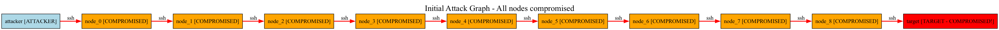
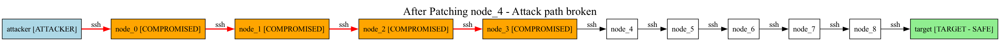
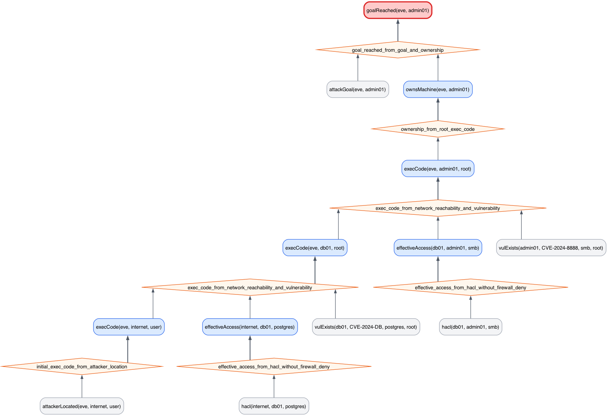
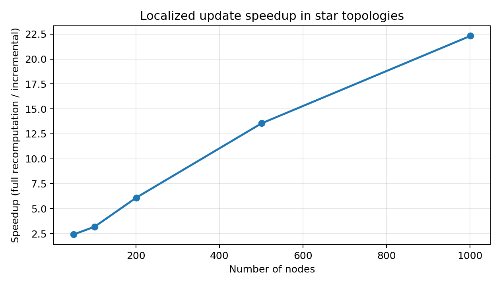
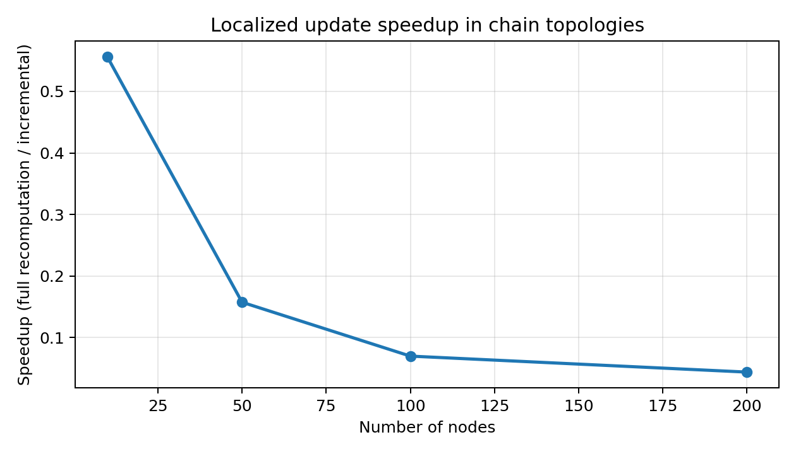
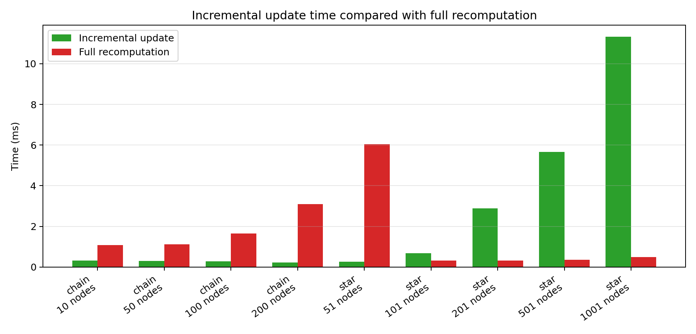
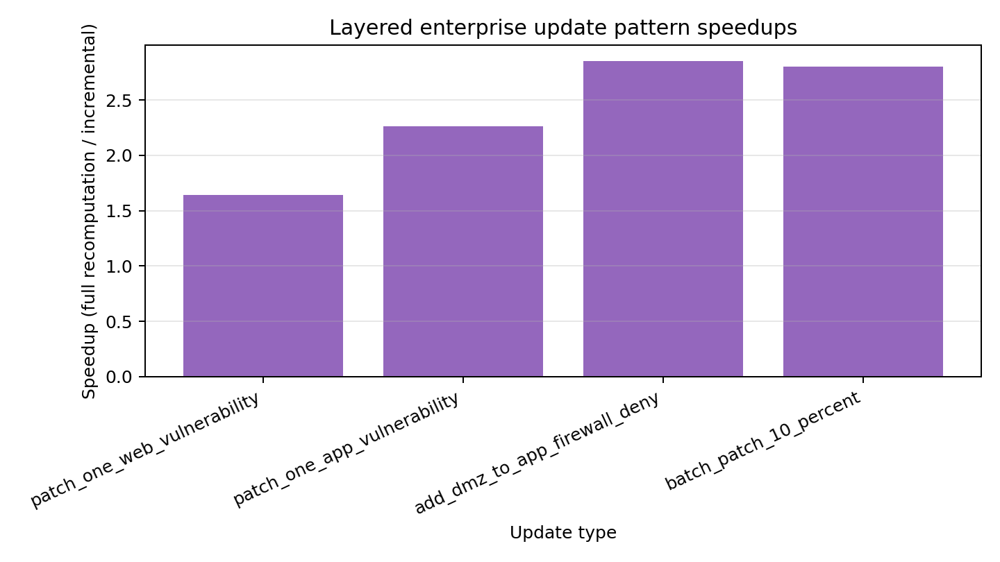

# Dynamic Attack Graphs using Differential Dataflow

**Research prototype for incremental maintenance of MulVAL-style attack graph rules using Rust and Differential Dataflow.**

The prototype supports recursive attack propagation, stratified firewall negation,
local privilege escalation, MulVAL-like scenario files, naive fixpoint validation,
full recomputation baselines, CSV benchmark export, and initial provenance
explanations. It implements a subset of MulVAL-style rules; it is not a full
MulVAL replacement or a production security analyzer.

In localized synthetic star scenarios, incremental updates are substantially
faster than recomputation. Exact speedups should be regenerated with the current
benchmark runner before being reported.

---

## 🚀 Quick Start (Docker - Recommended)

**One command to see benchmark results:**

```bash
docker build -t attack-graph .
docker run --rm attack-graph
```

This runs the benchmark suite and prints timing tables. Older example output may
include speedups comparing initial computation with incremental update; current
research reporting should use the full recomputation-after-update columns:

```
| Nodes | Initial (ms) | Incremental (us) | Recompute after update (ms) | Recompute speedup |
|------:|-------------:|-----------------:|----------------------------:|------------------:|
|  ...  |          ... |              ... |                         ... |               ... |
```

---

## 📊 Visual Results

The repository includes generated figures for the current prototype. Exact
benchmark numbers depend on machine and runtime conditions; regenerate all
figures and the paper with `./scripts/generate_all_artifacts.sh` before using
numbers in final research reporting.

### Attack Graph Before and After Patch

The Graphviz example generates before/after images showing how patching breaks
attack paths:

```bash
# Run the visualization example
cargo run --release --example graphviz_export

# Convert to PNG (requires graphviz)
dot -Tpng graph_initial.dot -o docs/assets/graph_initial.png
dot -Tpng graph_final.dot -o docs/assets/graph_final.png
```

Red edges mark active attack paths. After the patch, dependent paths disappear
from the active compromise chain.

| Before Patch | After Patch |
|:---:|:---:|
|  |  |

**Legend:**
- 🔵 Blue: Attacker starting position
- 🟠 Orange: Compromised nodes
- 🔴 Red: Target compromised
- 🟢 Green: Target safe
- Red edges: Active attack path

### Visualizing Provenance Explanations

Generate a proof tree for a selected goal and export it as Graphviz DOT:

```bash
cargo run --release --example explain_goal

# Convert the explanation graph to PNG
dot -Tpng explanation_goal.dot -o explanation_goal.png
```

The generated `explanation_goal.dot` shows base facts as gray boxes, derived
facts as blue boxes, rule applications as orange diamonds, and the selected
target goal highlighted in red. The provenance layer reconstructs one valid
explanation after computation; it does not enumerate all minimal attack paths or
store proof trees inside Differential Dataflow.



### Benchmark Plots

The benchmark plots compare localized incremental updates against full
recomputation after the same update.









---

## Interactive Project Presentation

The repository includes a standalone static website that explains the motivation,
theory, architecture, rule translation, correctness validation, benchmarks,
provenance, implemented research extensions, limitations, and reproducibility
workflow. It does not embed the paper PDF.

```bash
open website/index.html
```

or serve the repository locally:

```bash
python3 -m http.server 8000
open http://localhost:8000/website/
```

The site uses the generated figures and benchmark CSV in `website/assets/`.
It covers architecture, Datalog-style rules, Differential Dataflow translation,
incremental update walkthroughs, correctness validation, benchmarks, provenance,
affected-region metrics, and future work.

---

## 🛠 Local Development

### Requirements

- Rust 1.70+ (install from [rustup.rs](https://rustup.rs))
- Graphviz (optional, for visualization): `brew install graphviz`

### Build and Run

```bash
# Build
cargo build --release

# Run the hardcoded incremental demo
cargo run --release

# Run a MulVAL-like .facts scenario
cargo run --release -- --scenario examples/scenarios/simple_enterprise.facts

# Run a scenario and apply incremental removals/insertions from an update file
cargo run --release -- \
  --scenario examples/scenarios/simple_enterprise.facts \
  --update path/to/update.facts

# Run benchmarks
cargo run --release --example run_benchmarks

# Run simple example
cargo run --release --example simple_demo

# Run visualization export
cargo run --release --example graphviz_export

# Run provenance explanation export
cargo run --release --example explain_goal
```

Scenario files use simple base facts:

```prolog
vulExists(web01, cve_2024_1234, http, user).
hacl(internet, web01, https).
firewallDeny(internet, web01, http).
attackerLocated(eve, internet, user).
attackGoal(eve, admin01).
```

Update files may remove existing base facts with:

```prolog
remove(vulExists(web01, cve_2024_1234, http, user)).
remove(hacl(internet, web01, https)).
remove(firewallDeny(internet, web01, http)).
```

---

## 📈 Benchmark Results

See [BENCHMARKS.md](BENCHMARKS.md) for detailed analysis.

### Summary

| Topology | Change Type | Expected Behavior |
|----------|-------------|-------------------|
| Star | Patch one leaf | Localized update; recomputation speedup should be largest |
| Chain random cut | Patch random node | Cost depends on downstream affected region |
| Chain worst case | Patch near start | Approaches full recomputation cost |
| Layered enterprise | Patch or firewall update | More realistic layered propagation and fan-out |

**Key insight:** Incremental update complexity is O(affected nodes), not O(total nodes).
Regenerate current numbers with:

```bash
cargo run --release --example run_benchmarks -- --csv results.csv
```

---

## Regenerating Figures and Paper

```bash
./scripts/generate_all_artifacts.sh
```

Dependencies:
- Rust stable
- Graphviz (`brew install graphviz` on macOS)
- Python 3
- matplotlib (`pip install matplotlib`)
- LaTeX distribution with `latexmk` or `pdflatex`/`bibtex`

---

## 🏗 Architecture

```
+-----------------------------------------------------------+
|                     INPUT FACTS                           |
+-----------------------------------------------------------+
|  vulnerabilities  : (Host, CVE, Service, Privilege)       |
|  network_access   : (Source, Destination, Service)        |
|  firewall_rules   : (Src, Dst, Service, Action)           |
|  attacker_start   : (Attacker, Host)                      |
+-----------------------------------------------------------+
                              |
                    Differential Dataflow
                   (incremental maintenance)
                              |
                              v
+-----------------------------------------------------------+
|                    DERIVED FACTS                          |
+-----------------------------------------------------------+
|  execCode      : (Attacker, Host, Privilege)              |
|  ownsMachine   : (Attacker, Host)                         |
|  goalReached   : (Attacker, Target)                       |
+-----------------------------------------------------------+
```

When any input changes, only affected derived facts are recomputed.

---

## 📂 Project Structure

```
src/
  schema.rs      - Data type definitions
  rules.rs       - Attack graph inference rules
  engine.rs      - Shared engine data model and comparison helpers
  engines/       - Full recompute, naive, and Differential wrappers
  metrics.rs     - Affected-region update metrics
  naive.rs       - HashSet fixpoint evaluator for correctness checks
  parser.rs      - MulVAL-like .facts parser
  provenance.rs  - Explanation trees and DOT export
  benchmarks.rs  - Performance measurement code
  main.rs        - Main demonstration
  lib.rs         - Library exports

examples/
  run_benchmarks.rs   - Full benchmark suite
  graphviz_export.rs  - Visual graph generation
  explain_goal.rs     - Provenance explanation DOT export
  simple_demo.rs      - Minimal working example
  scenarios/          - Example .facts scenario files

tests/
  incremental_correctness.rs
  local_privilege_escalation.rs

paper/
  main.tex       - LaTeX research paper
  references.bib - Bibliography

docs/
  PHASE1_CONCEPTUAL_FRAMEWORK.md
  PHASE2_ARCHITECTURE.md
```

---

## 📄 Documentation

- [BENCHMARKS.md](BENCHMARKS.md) - Detailed benchmark results and analysis
- [docs/PHASE1_CONCEPTUAL_FRAMEWORK.md](docs/PHASE1_CONCEPTUAL_FRAMEWORK.md) - Theory background
- [docs/PHASE2_ARCHITECTURE.md](docs/PHASE2_ARCHITECTURE.md) - Implementation details
- [paper/main.tex](paper/main.tex) - LaTeX research paper

---

## 🔬 How It Works

### MulVAL-style Rule (Datalog)
```prolog
execCode(Attacker, Host, Priv) :-
    execCode(Attacker, SrcHost, _),
    netAccess(SrcHost, Host, Service),
    vulExists(Host, _, Service, Priv).
```

### Differential Dataflow Translation (Rust)
```rust
let reachable = initial_positions.iterate(|inner| {
    inner
        .join(&network_access)      // Find where attacker can go
        .semijoin(&vulnerabilities) // Keep only vulnerable targets
        .concat(inner)              // Add to existing reachable set
        .distinct()                 // Remove duplicates
});
```

When a vulnerability is removed, the `semijoin` propagates the deletion through the dataflow graph, removing all dependent attack paths automatically.

---

## 📚 References

1. Ou, X., et al. "MulVAL: A Logic-based Network Security Analyzer." USENIX Security 2005.
2. McSherry, F., et al. "Differential Dataflow." CIDR 2013.
3. Murray, D., et al. "Naiad: A Timely Dataflow System." SOSP 2013.

---

## 📜 License

MIT License
